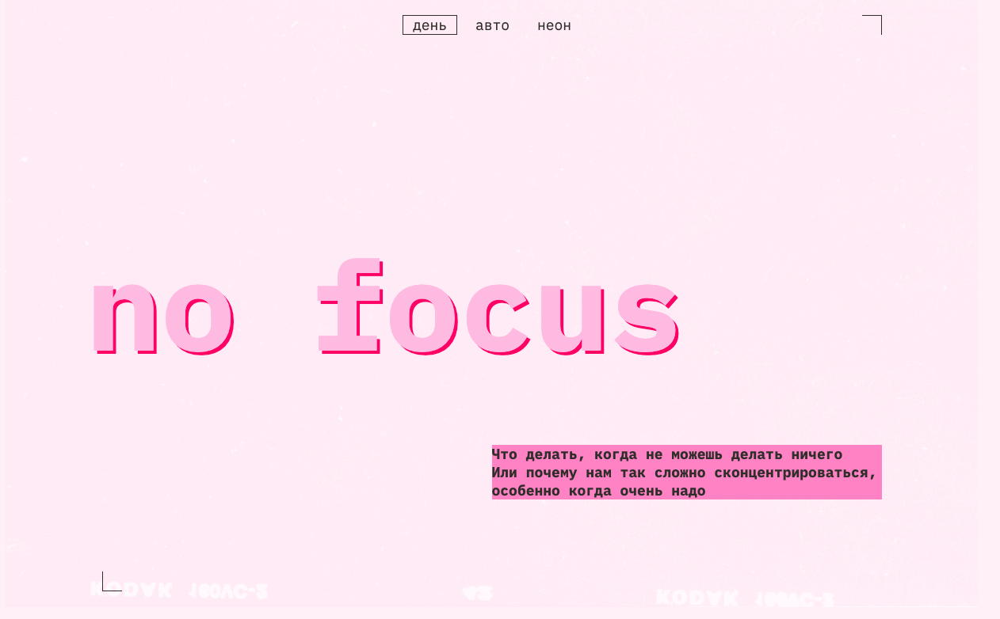

# **«In focus»**

---

_Проект выполнен в виде однострочного сайта, для практического изучения `Gulp` и `Pug`._

---

  

<b>Ссылки на проект:</b>

Frontend (деплой): https://main--flourishing-youtiao-0473e8.netlify.app/

---

### **Используемый Стек:**

---

### **Установка и запуск:**

1. `git clone https://github.com/Markelov97Vad/focus.git` - клонировать репозиторий на свое устройство (HTTPS)
2. `npm i` - установить зависимости
3. `npm run build` - запустить сборку
4. `npm run dev` - запустить приложение в режиме разработки